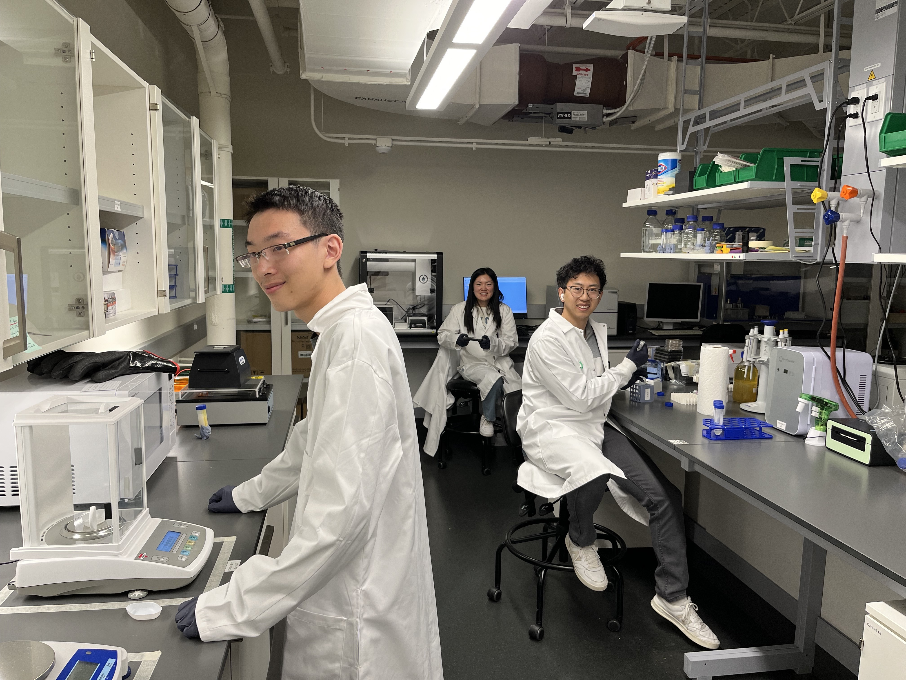

+++
widget = "awesome"
headless = true
active = true
weight = 1

title = ""
subtitle = ""
  
[advanced]
 # Custom CSS. 
 css_style = ""
 
 # CSS class.
 css_class = ""
+++

# Synthetic Biology Workshop

<strong>Dates:</strong> June 17-18, 2024

<strong >Location:</strong> University of Colorado Boulder

<strong>Room:</strong> TBA

<strong>Registration Deadline:</strong> June 10th

This workshop is free to all attendees. Breakfast, lunch, and dinner will be provided both days for the event.

**Register for the Workshop:** <a href="https://docs.google.com/forms/d/e/1FAIpQLSfJymK6jK3u3jopTuSWuPojhUD9RnT1k_hsTVJVtsjka_QKSA/viewform?usp=sf_link" style="font-size: 24px;">Register via Google Form</a>

## What is Synthetic Biology?

    

        
Researchers are now able to engineer synthetic genetic circuits for a range of applications in the environmental, medical, and energy domains. Crucial to the success of these efforts is the development of methods and tools for genetic design automation (GDA). While inspiration can be drawn from experiences with electronic design automation (EDA), design with a genetic material poses several challenges. In particular, genetic circuits are composed of very noisy components making their behavior more asynchronous, analog, and stochastic in nature. This workshop presents a design-build-test-learn workflow for synthetic biology. We will introduce data repositories that provide information about genetic parts, sequence-level design tools to compose these parts into circuits, and modeling and simulation tools to evaluate alternative design choices. We will also introduce basics about the experimental methods used to build and test these genetic designs. Finally, we will demonstrate how laboratory automation can accelerate this entire workflow.

    

    

        <iframe width="560" height="315" src="https://www.youtube.com/embed/zggU1KCgc7A?si=q9Z2_HH18-ZcNIFT" title="YouTube video player" frameborder="0" allow="accelerometer; autoplay; clipboard-write; encrypted-media; gyroscope; picture-in-picture; web-share" referrerpolicy="strict-origin-when-cross-origin" allowfullscreen></iframe>
    

## Topics Covered

<ul style="list-style-type: none; display: inline; font-size:20px">
    <li>- Biological parts and repositories where to find them</li>
    <li>- Genetic devices and software to construct them</li>
    <li>- Experimental techniques to build and test designs</li>
    <li>- Modeling and analysis of biological circuits</li>
    <li>- Laboratory automation</li>
</ul>

    

### More Information

    
This event is organized by the FLUENT Research Group. To learn more about our projects, <a href="https://fluentverification.github.io">visit our website</a>.

### Acknowledgements

This project is funded by grants 1856733, 1856740, and 1900542 from the National Science Foundation. The views expressed are those of the authors and do not necessarily reflect those of the NSF.

    
    
    
    

**Questions? Contact Chris Myers at:** chris.myers@colorado.edu
